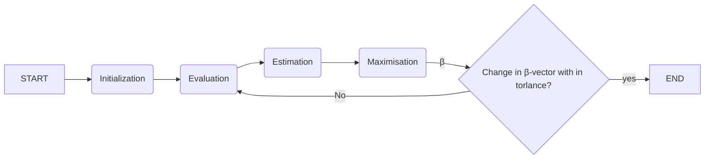

# Abstract:
Summarize the key objectives, methodology, and findings of the thesis.

# Chapter 1: Introduction
## 1.1 Background and Motivation

Discuss the significance of mixture models in various fields (e.g., statistics, machine learning, bioinformatics).
Highlight the challenges in optimizing mixture model parameters.

## 1.2 Research Objectives

Clearly state the main objectives of the thesis.
## 1.3 Research Questions

Formulate specific research questions that the thesis aims to address.
## 1.4 Contribution

Outline the unique contributions of the work to the field of mixture modeling and EM algorithms.
# Chapter 2: Literature Review
## 2.1 Overview of EM Algorithm

Explain the basic concepts of the Expectation-Maximization algorithm.
Discuss its applications and limitations.
## 2.2 Existing Enhancement Techniques

Review various extensions and enhancements of the EM algorithm proposed in the literature.
Highlight how these techniques address specific challenges.
## 2.3 Relevant Tools and Concepts

Introduce the various tools you'll be incorporating into the EM algorithm (e.g., Bayesian statistics, optimization methods, data preprocessing techniques).
# Chapter 3: Methodology
## 3.1 Algorithm Workflow
Present a step-by-step description of the integrated EM algorithm.

## 3.2 Data generating
1. Genterate a matrix β using the function GenBeta(p, K, nonzerodimratio), which creates a matrix where each 
2. in each component k, beta(k) = 
$$ β_{0}(k) = 2(rand() - 1)·u_{set}(:, k)^{T}·β(:, k) $$
3. combine β and β0 into a single matrix

## 3.3
### Objective Function:

    The goal is to maximize the "Score," which is a measure of how well the mixture model fits the data.
    The score is related to the coefficient of determination (r2) for the regression.

**Model Prediction**:
   - Mathematical Relationship: 

$$ \widehat{y} = X \cdot \beta + Offset  $$

   - Variables:
     - \( \hat{y} \): Predicted values
     - \( X \): Input matrix
     - \( \beta \): Coefficient vector
     - \( \text{Offset} \): Offset term

**Error Calculation**:
   - Mathematical Relationship:

$$ err = \widehat{y} - y $$

   - Variables:
     - \( \text{err} \): Error vector
     - \( \hat{y} \): Predicted values
     - \( y \): Actual target values

**R-squared Calculation**:
   - Mathematical Relationship: \( r^2 = 1 - \frac{\sum (y - \sum (w \cdot \hat{y}))^2}{SSy} \)

$$ r^{2} = 1 - \frac{\sum(y - \sum(w \cdot \widehat{y}))^{2}}{SSy} $$

   - Variables:
     - \( r^2 \): Coefficient of determination (R-squared)
     - \( y \): Actual target values
     - \( \hat{y} \): Predicted values
     - \( w \): Weighting factors
     - \( SSy \): Total sum of squares of \( y \)

### E-Step (Expectation Step):

    The likelihood of each data point belonging to a component is evaluated using the likelihood function phi.
    The weights w are updated based on the calculated likelihoods.
    The posterior likelihood is the product of the prior likelihood pr and the likelihood phi.

In the E-Step of the EM algorithm, the code calculates the likelihoods and updates the weights for each data point to determine their association with the mixture components. The goal is to assess the probability of each data point belonging to each component.

**Likelihood Calculation**

For each data point n and mixture component k. the likelihood φ_nk is evaluated. The likelihood measures the probability of data point n being generated by component k of the mixture model.

**Weight Update**

The weights w_nk for each data point-component pair are updated based on the calculated likelihoods. These weights represent the contribution of data point n to component k of the mixture model.

$$w_{nk} = \frac{p_{rk}\cdot{\phi_{nk}}}{\sum_{j=i}^{K} p_{rj} \cdot \phi_{nj}}$$

Where:
- p_r represents the prior probabilities of each mixture component.
- K is the total number of mixture components.
- Φ_nk is the likelihood of data point n belonging to component k.
- w_nk is the updated weight for data point n in component k.

This weight update ensures that data points are attributed to components based on their likelihoods and proportional contributions.
### M-Step (Maximization Step):

    The prior likelihood pr is updated based on the weighted proportions of data points belonging to each component.
    The regression coefficients beta are updated using weighted regression techniques.

**Prior Probability Update**

The prior probabilities p_r​ for each mixture component are updated based on the proportions of data points assigned to each component:

$$p_{rk} = \frac{\sum_{n=1}^{N} w_{nk}}{N}$$

Where:
- N is the total number of data points.
- w_nk is the weight of data point n in component k.
- p_rk is the updated prior probability for component k.

**Regression Coefficient Update**

The regression coefficients β_k for each component are updated using weighted regression techniques. The specific update method may vary based on the chosen regression approach. One possible method is weighted least squares (WLS):

$$\beta_k = \argmin_{\beta_k}\sum_{n=1}^{N} w_{nk}\cdot ||y_{n} - {X_{n} \beta_{k}}||_{2}^{2}$$

Where:
- y_n is the response variable for data point n.
- X_n represents the feature matrix for data point n.
- w_nk is the weight of data point n in component
- β_k is the updated regression coefficient vector for component k.

The M-Step involves updating the prior probabilities and regression coefficients to optimize the model's fit to the data, based on the weights assigned to each data point in the E-Step.

### Scale Estimation:

    The code includes options for different methods of estimating the scale (variance) of the error distribution, including Tukey, Cauchy, and others.

In the Scale Estimation step, the algorithm estimates the scale (variance) of the error distribution based on various methods. The updated scale (σ^2) is used in subsequent calculations.

**Tukey Weight Function**

For the Tukey weight function, the scale estimate is calculated using the following formula:

$$\sigma^2 = \frac{\sum_{n=1}^{N} w_{nk} \cdot err_{n}^{2}}{\sum_{n=1}^{N} w_{nk}} \cdot \frac{1}{csq \cdot d}$$

Where:
- w_nk is the weight of data point n in component k.
- err_n is the error (residual) of data point n.
- csq and d are constants related to the Tukey weight function.

For other weight functions such as Cauchy, Welsch, or t-robust, similar approaches are used to estimate the scale (σ^2) based on the corresponding weight functions. The Scale Estimation step enhances the robustness and accuracy of the model by accounting for the variability in the error distribution.

### Initialization:

    The initial solution can be initialized using methods like K-means clustering or tensor factorization.

In the Initialization step, the algorithm initializes the parameters of the EM algorithm and the mixture model. Different methods are used to set initial values for parameters such as regression coefficients, data point weights, and prior component probabilities.

**Tensor Factorization Initialization**
In the Tensor Factorization Initialization method, a third-order tensor factorization approach is used. The response variable y and the feature matrix X are centered (mean-subtracted). Then, the factorization process is applied to estimate the regression coefficients (β_k) and other model parameters.

### Termination Criteria:

    The EM algorithm iterates until convergence or a maximum number of iterations is reached.
    Convergence is determined by changes in the score over iterations.

The Termination Criteria determine when the EM algorithm should stop iterating. These criteria are designed to identify when the algorithm has converged to a solution or when it has reached the maximum number of iterations.

**Convergence Check**
The convergence check involves monitoring the change in the EM algorithm's performance score over a few recent iterations. If the change in the score becomes smaller than a specified threshold, it indicates that the algorithm is converging, and further iterations might not significantly improve the solution.

**Iteration Limit**
Additionally, the algorithm is limited by the maximum number of iterations (MaxIter) specified in the options.

# Chapter 4: Experiments and Results
## 4.1 Experimental Setup

Explain the datasets used and the evaluation metrics chosen.

## 4.2 Analysis of Results

Interpret the results, discussing the impact of each incorporated tool on the algorithm's performance.

# Chapter 5: Conclusion and Future Work
## 5.1 Summary of Findings

Summarize the main outcomes and contributions of the research.
## 5.2 Implications and Significance

Discuss the broader implications of the work for the field of mixture modeling and beyond.
## 5.3 Future Directions

Outline potential areas of further research and improvements for the integrated EM algorithm.
# References:
Cite all the relevant sources you referred to throughout the thesis.

----------

## 3.3 part 1: Initialization

randon kmean tensor 
## 3.3 part 2: RegressWeight

Outlier weight-out method to achieve "robust" regression
tukey huber welsch cauchy t-robust
## 3.3 part 3: ScaleEstWeight

Outlier weight-out method to achieve "robust" regression
## 3.3 part 4: RegressMethod

LS larsn
## 3.3 part 5: TrimMethod

MCD none
## 3.3 part 6: RegressMethod

<html>
    <head>
        
        
    </head>
    <body>
        
    </body>
</html>
